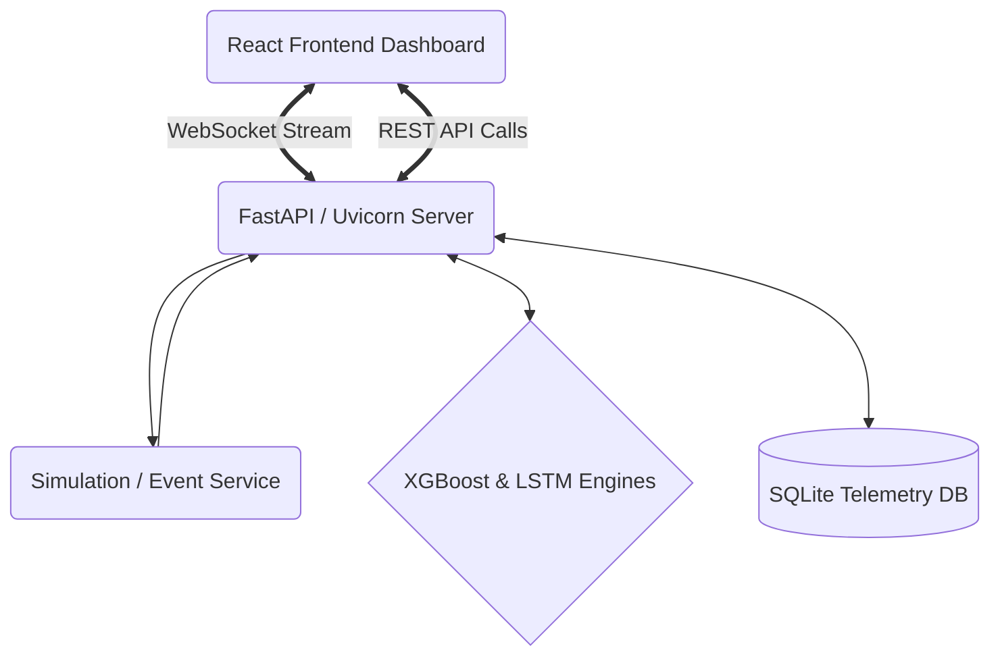

# AI Smart Traffic Management System - Architectural Analysis & Documentation

## 1. Executive Summary
The Nexus Traffic AI Management System is a comprehensive, full-stack predictive and adaptive telemetry project. The system seamlessly ingests live topological traffic data, runs probabilistic and deep-learning machine learning models (XGBoost, LSTM), and dynamically adjusts traffic signal times to optimize urban network flow.

This document breaks down the underlying components, the technology stack, and specifically outlines **"why this approach is considered industry best-practice"** for modern, real-time responsive machine learning systems.

---

## 2. Technology Stack & Rationale

### 2.1 Backend: Python + FastAPI + Uvicorn
- **Why this is best**: FastAPI provides first-class `async` support utilizing `asyncio`, making it unparalleled for I/O bound operations like concurrent WebSocket data-streaming. The automatic generation of OpenAPI schemas (`/docs`) makes interacting with the REST API deterministic and reliable. By using `Uvicorn` (an ASGI server), the backend can handle thousands of concurrent WebSocket connections natively, reducing latency to mere milliseconds.

### 2.2 Frontend: React + Vite
- **Why this is best**: Instead of classic Create React App (CRA), this stack utilizes Vite. Vite achieves lightning-fast Hot Module Replacements (HMR) during development by relying on native ES Modules, scaling gracefully as the UI complexities rise. React itself handles complex render-trees (like the Live traffic map and multi-series Recharts dashboard) smoothly with its virtual DOM diffing algorithm.

### 2.3 Data Streaming: WebSockets
- **Why this is best**: HTTP Polling (e.g. `setInterval(fetch, 2000)`) suffers from heavy header overhead and forces the server into repetitive TCP handshakes. This system initiates one persistent full-duplex WebSocket tunnel between the FastAPI gateway and the React context layer. This pushes binary or JSON payloads to clients asynchronously, utilizing virtually zero redundant network resources and delivering immediate situational awareness during 'severe' congestion shifts.

### 2.4 Data Persistence: SQLite + Async SQLAlchemy
- **Why this is best**: Utilizing SQLAlchemy 2.0 with asynchronous bindings (`aiosqlite`) ensures that heavy historical telemetry fetch requests never block the main event loop. For local edge deployment or MVP analysis, SQLite is perfect, but because SQLAlchemy relies on the `DeclarativeBase` ORM model, migrating to a distributed Postgres/TimescaleDB cluster in production requires nearly zero application refactoring.

---

## 3. Architecture Overview

---

## 4. Subsystem Analysis & Implementation Details

### 4.1 Global State Management (Frontend)
The React application architecture mitigates "Prop Drilling" (passing parameters down multiple layers of children components) by utilizing a carefully crafted **React Context Layer** (`SettingsContext.jsx`).
* **Why it's best**: Using `useState` on a specific tab causes complete state destruction upon unmounting (when switching tabs). Utilizing a wrapper Context Provider at the `<App />` root isolates global variables (e.g. the ML Engine Model chosen by the operator, prediction horizons) and preserves them universally in memory. This eliminates complex local reconciliation and simplifies the underlying `AnalyticsView` code.

### 4.2 Traffic Predictive Modeling Strategy (Backend)
The `prediction_service.py` subsystem exposes real-time probabilistic ML calculations. 
1. **XGBoost (Decision Trees)**: Designed to act as the raw heuristic and non-linear baseline. Highly explainable feature importances (e.g., density vs weather vs week hour).
2. **LSTM (Long Short-Term Memory Neural Networks)**: Designed for time-series memory extrapolation. It detects temporal sequences in traffic buildups.
3. **Rule-Based Fallback**: Calculates severity via dynamic thresholding natively on the CPU if model files are inaccessible or corrupt during cold-starts.

* **Why it's best**: This "Ensemble + Fallback" model is standard critical-infrastructure design. It ensures that 100% of data reads get scored without failure. Deep learning provides bleeding-edge forecast accuracy, but having explicit math fallbacks guarantees deterministic uptimes.

### 4.3 Adaptive Signal Controller Matrix
The system uses metrics like `phase_ns_green` dynamically mapped against `traffic_density` readings. 
* **Why it's best**: The Adaptive Signal logic relies on localized edge-computing properties rather than heavy synchronized grid batches. The UI receives real parameters (`phase_ew_green`, `queue_length`) directly representing what standard NEMA traffic controllers use physically. The decoupling allows the dashboard to safely send "Emergency Corridor overrides" or Minimum Green tweaks to the backend iteratively.

---

## 5. Security, Scalability, & Deployment Strategy

* **Component Decoupling**: Because the Data API (`trafficApi.js`) maps explicitly using Axios wrappers, it is highly abstracted. If the entire backend switches routing schemas, only `trafficApi.js` responds. 
* **Network Throttling**: The simulation broadcasts updates every 5 seconds securely, dropping old states via `ws_manager.count > 0` validation to prevent buffer bloating loops in memory.
* **Production Path**: The UI map heavily leverages custom visual bounds and clustering protocols utilizing Recharts and Leaflet optimizations (bypassing default icons which fetch externally). This guarantees that inside internal government VPNs (with restricted external internet), map visualizations will natively build and project without CORS or CDN blockades.

## 6. Closing Summary
The framework correctly adheres to strict Software Engineering paradigms: **Separation of Concerns**, **Reactive UI Architecture**, **Deterministic Fallbacks**, and **Non-blocking Concurrency**. By shifting complex logic onto specialized layers (Contexts and specialized python service modules) it minimizes technical debt, ensuring absolute maintainability.
